# SoundWave


[](https://www.docker.com/)
[](LICENSE)

**SoundWave** is a self-hosted audio archiving and streaming platform inspired by TubeArchivist. Download, organize, and enjoy your YouTube audio collection offline through a beautiful dark-themed web interface.

## Screenshots

<p align="center">
  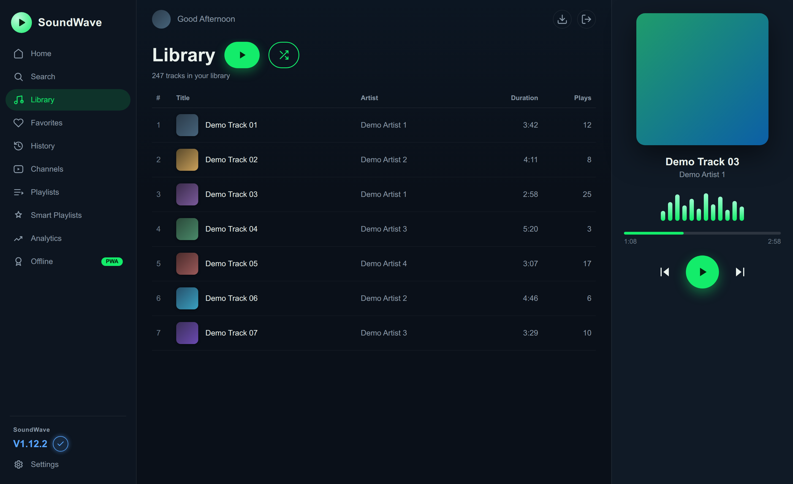
</p>

<table>
  <tr>
    <td width="33%">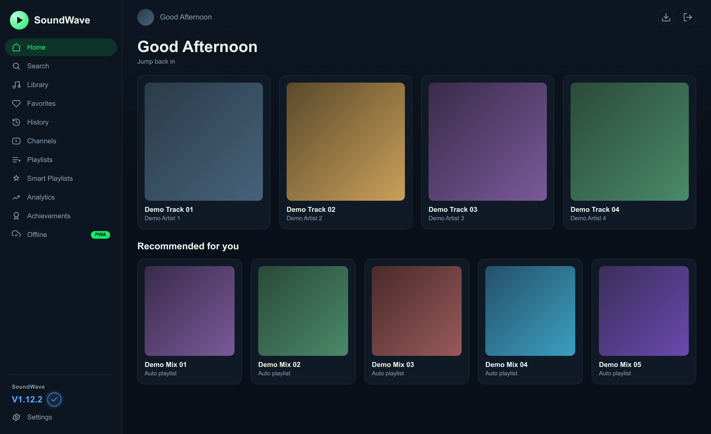<br/><sub><b>Home</b></sub></td>
    <td width="33%">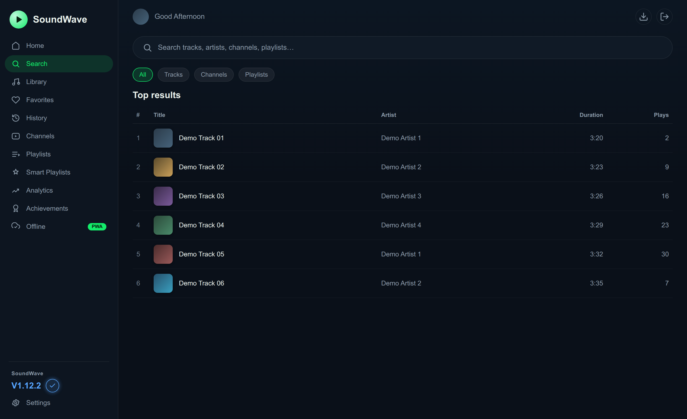<br/><sub><b>Search</b></sub></td>
    <td width="33%">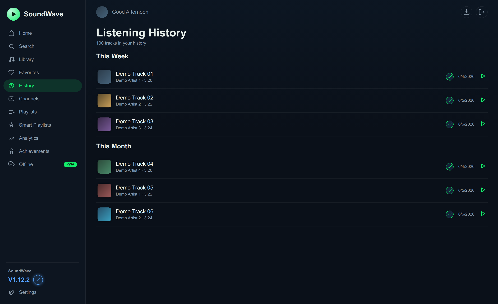<br/><sub><b>Listening History</b></sub></td>
  </tr>
  <tr>
    <td>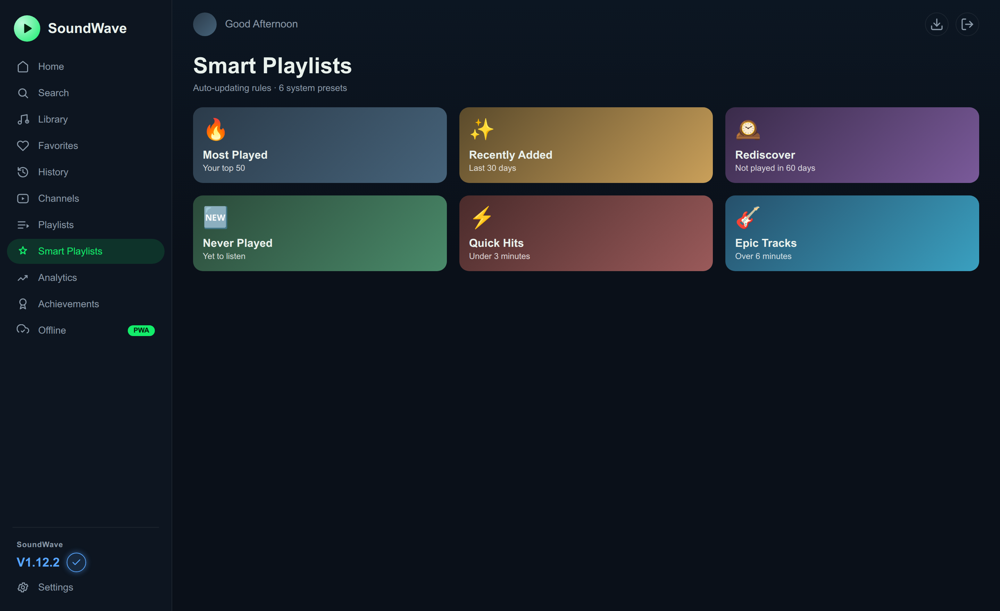<br/><sub><b>Smart Playlists</b></sub></td>
    <td>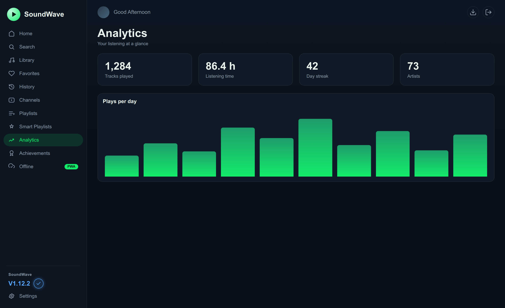<br/><sub><b>Analytics</b></sub></td>
    <td>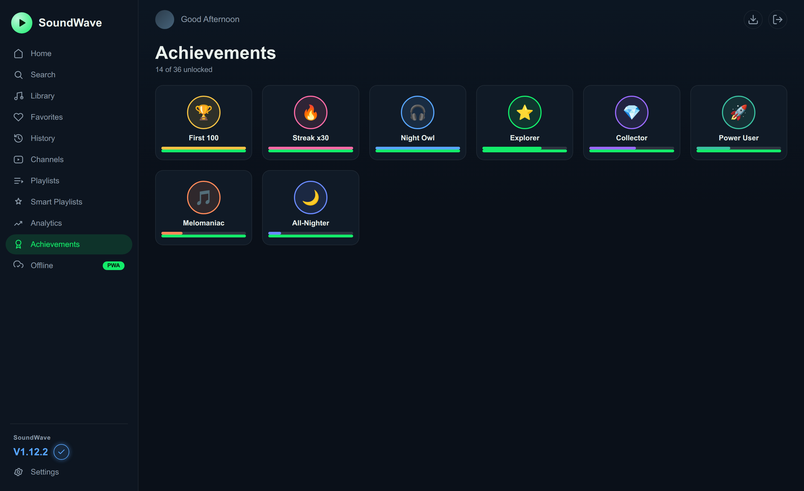<br/><sub><b>Achievements</b></sub></td>
  </tr>
  <tr>
    <td>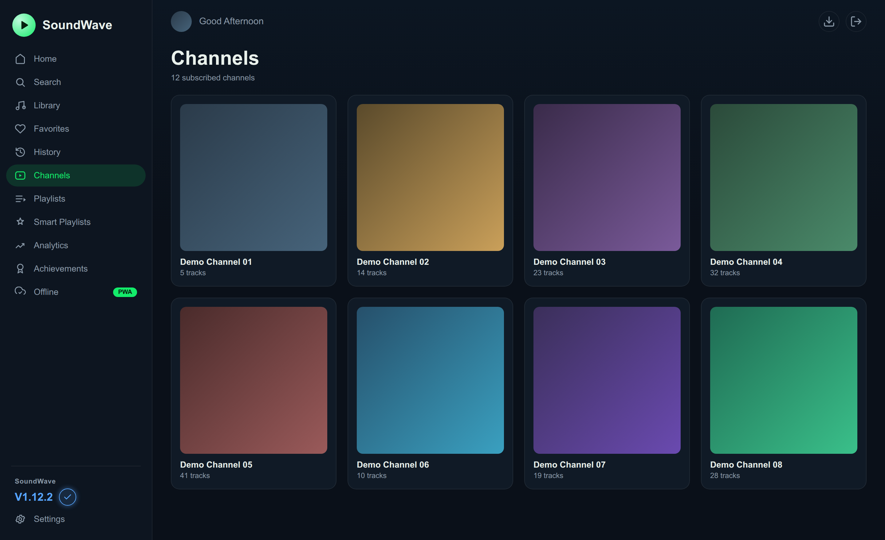<br/><sub><b>Channels</b></sub></td>
    <td>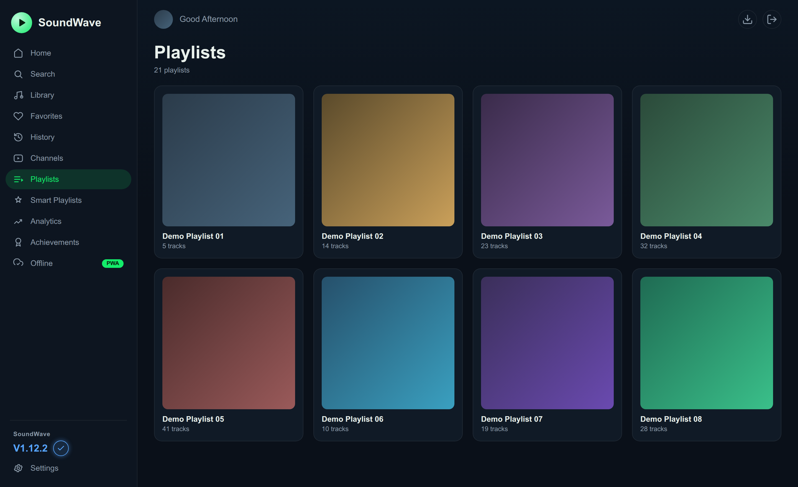<br/><sub><b>Playlists</b></sub></td>
    <td>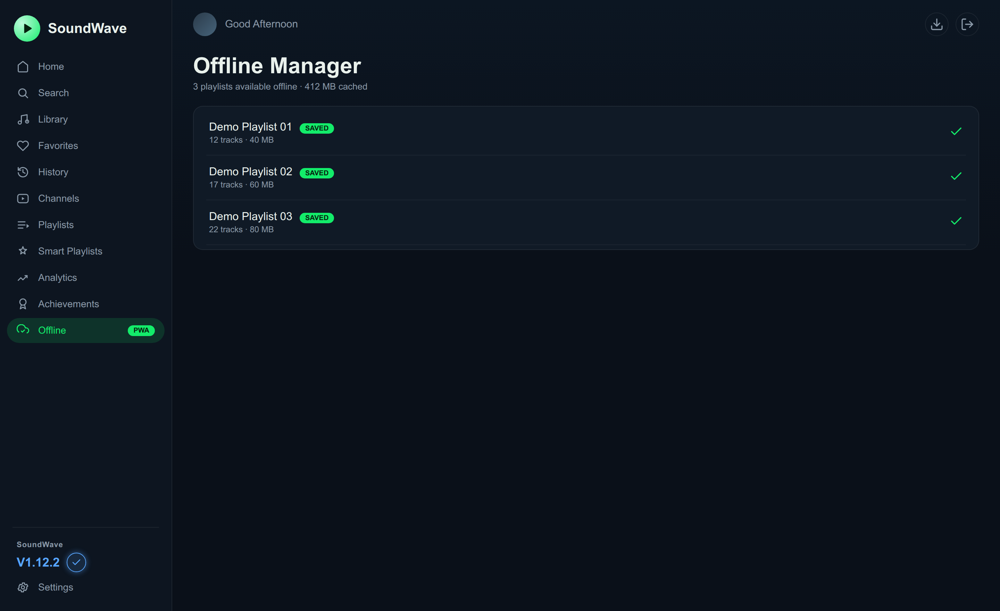<br/><sub><b>Offline (PWA)</b></sub></td>
  </tr>
  <tr>
    <td>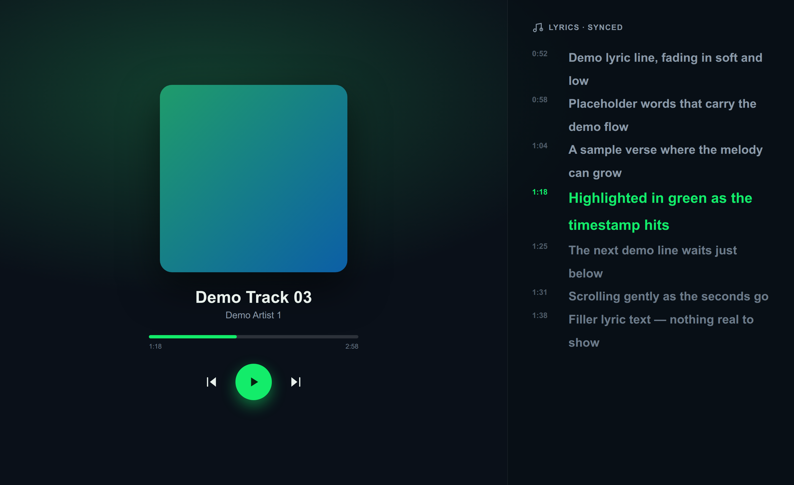<br/><sub><b>Synced lyrics</b></sub></td>
    <td>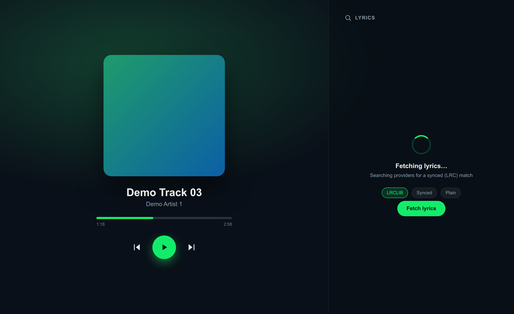<br/><sub><b>Lyrics fetch</b></sub></td>
    <td>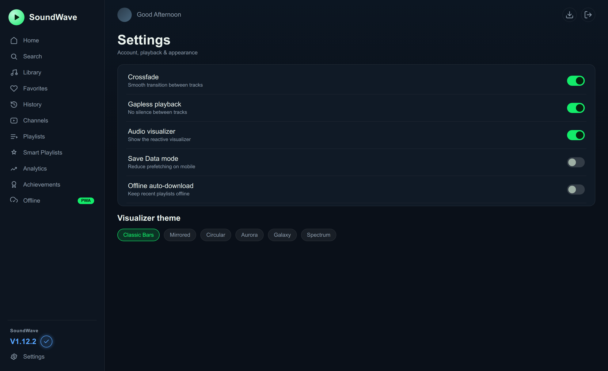<br/><sub><b>Settings</b></sub></td>
  </tr>
</table>

<sub>UI previews shown with placeholder data only (no real titles, artwork, or personal data).</sub>

## Features

### Core Features
- **Audio-Only Downloads** - Extract high-quality audio from YouTube using yt-dlp
- **Smart Organization** - Index audio files with full metadata (title, artist, duration, etc.)
- **Powerful Search** - Find your audio quickly with ElasticSearch-powered indexing
- **Built-in Player** - Stream your collection directly in the browser
- **Auto-Play / Continuous Playback** - Automatically plays next track in queue
- **Repeat Modes** - Repeat one track, repeat all, or normal playback
- **Shuffle** - Smart shuffle and regular shuffle modes
- **Channel Subscriptions** - Subscribe to YouTube channels and automatically download new audio
- **Playlists** - Create custom playlists or sync YouTube playlists
- **Force Recheck** - Per-playlist force recheck to verify and re-download missing files
- **Smart Playlists** - Dynamic auto-updating playlists based on rules (Most Played, Recently Added, Genre filters, and more)
- **Multi-Language UI** - Full English and Romanian translations across all pages

### Analytics & Achievements
- **Achievements System** - 37 unlockable achievements across 6 categories (Tracks, Hours, Streaks, Artists, Channels, Special)
- **Listening Streaks** - Track daily listening streaks with visual weekly activity grid
- **Yearly Wrapped** - Spotify-style year-in-review with top artists, tracks, and personalized insights
- **Achievement Notifications** - Real-time celebration popup with confetti when unlocking achievements
- **Listening History** - Complete history of played tracks with "On This Day" memories
- **Analytics Dashboard** - Detailed listening insights, genre breakdown, peak hours, and more

### Lyrics Features
- **Synced Lyrics** - Display lyrics in sync with music playback (online & offline)
- **LRC Upload** - Upload your own .lrc files for synced lyrics
- **Lyrics Search** - Search and apply lyrics from LRCLIB database
- **Persistent Lyrics** - Uploaded lyrics are saved permanently with the track

### Export & Download
- **Export Dialog** - Export tracks as MP3 or FLAC with embedded metadata
- **Embedded Lyrics** - Export with synced lyrics (SYLT for MP3, LRC for FLAC)
- **Embedded Artwork** - Include album art in exported files
- **Quality Selection** - Choose export quality (320kbps, 192kbps, 128kbps)

### PWA & Offline Features
- **PWA Support** - Install as mobile/desktop app with rounded app icon
- **Full Offline Playback** - Cache playlists with audio, lyrics, and metadata for offline use
- **Background Caching** - Non-blocking progress indicator while caching
- **Media Session Artwork** - Album art in system notifications (all browsers)
- **Battery Efficient** - Lightweight frontend with no background polling; server handles all heavy work
- **Configurable Sync** - Optional cross-device playback sync (can be disabled in settings)

### Visual & UI
- **Dark Theme** - Beautiful Material Design dark UI
- **Audio Visualizer** - Multiple visualization themes (Classic, Neon, Minimal, etc.)
- **Responsive Grid** - 2-column layout on mobile, scales to 4 columns on desktop
- **Offline Fallbacks** - Album art fallback icons when offline

### Other Features
- **Statistics** - Track plays, downloads, and library stats
- **User Management** - Multi-user support with authentication
- **Background Tasks** - Celery-powered async downloads and updates
- **Persistent Storage** - Data survives container rebuilds
- **Smart Error Handling** - Automatically skips permanently unavailable videos (copyright blocked, private, removed)
- **Deleted Video Detection** - Detects `[Deleted video]` / `[Private video]` entries from YouTube, skips download attempts, and preserves locally-kept copies
- **Admin User Management** - Full user deletion with cascade cleanup of audio files, channels, playlists, and avatars

## Architecture

- **Backend**: Django REST Framework (Python)
- **Frontend**: React + TypeScript + Material-UI
- **Database**: PostgreSQL (SQLite fallback for local development)
- **Search Engine**: ElasticSearch
- **Task Queue**: Celery + Redis
- **Audio Extraction**: yt-dlp + FFmpeg
- **Containerization**: Docker

## Prerequisites

- **Docker** (version 20.10+) and **Docker Compose V2** (`docker compose`, not the old `docker-compose`)
- **Python 3** on the host (for generating secrets in Step 3 — usually pre-installed)
- 2-4GB available RAM
- Dual-core CPU (quad-core recommended)
- Storage space for your audio library

## Quick Start

### Step 1: Download Files

```bash
# Create a directory for SoundWave
mkdir soundwave && cd soundwave

# Download docker-compose.yml
wget https://raw.githubusercontent.com/aiulian25/soundwave/main/docker-compose.prod.yml -O docker-compose.yml
```

### Step 2: Create Data Directories

**Important:** Docker needs these directories and files to exist before starting.

```bash
# Create directories
mkdir -p ./audio ./cache ./data

# Create an empty cookies.txt (required by the container — add YouTube cookies here if needed)
touch ./cookies.txt

# Set permissions for container user (1000:1000)
sudo chown -R 1000:1000 ./audio ./cache ./data
```

Or use the setup script:
```bash
wget https://raw.githubusercontent.com/aiulian25/soundwave/main/setup-dirs.sh
chmod +x setup-dirs.sh
./setup-dirs.sh
```

### Step 3: Create Environment File

```bash
# Generate all secrets
SECRET_KEY=$(python3 -c "import secrets; print(secrets.token_urlsafe(50))")
SW_PASS=$(python3 -c "import secrets; print(secrets.token_urlsafe(16))")
REDIS_PASS=$(python3 -c "import secrets; print(secrets.token_urlsafe(24))")
PG_PASS=$(python3 -c "import secrets; print(secrets.token_urlsafe(32))")
ES_PASS=$(python3 -c "import secrets; print(secrets.token_urlsafe(24))")

cat > .env << EOF
# Change SW_HOST to your server's IP/hostname if accessing from other machines
SW_HOST=http://localhost:8889
SW_USERNAME=admin
SW_PASSWORD=$SW_PASS
ELASTIC_PASSWORD=$ES_PASS
REDIS_HOST=soundwave-redis
REDIS_PASSWORD=$REDIS_PASS
# Change to your local timezone (e.g. Europe/London, America/New_York, Europe/Bucharest)
TZ=UTC
DJANGO_SECRET_KEY=$SECRET_KEY
# PostgreSQL
POSTGRES_DB=soundwave
POSTGRES_USER=soundwave
POSTGRES_PASSWORD=$PG_PASS
# Optional: uncomment and set to your server hostname/IP if getting 400 Bad Request errors
# DJANGO_ALLOWED_HOSTS=localhost,127.0.0.1,192.168.1.100
# Optional: auto-update yt-dlp on startup (recommended for production)
# SW_AUTO_UPDATE_YTDLP=true
# Optional: API keys for lyrics and artwork enrichment
# LASTFM_API_KEY=
# LASTFM_API_SECRET=
# FANART_API_KEY=
EOF

# Show your generated admin password — save this somewhere safe!
echo "Admin password: $SW_PASS"
```

### Step 4: Start SoundWave

```bash
docker compose up -d
```

Docker will automatically create the `pg_data` volume for PostgreSQL data. No manual volume creation is needed.

### Step 5: Access the Application

- **URL:** http://localhost:8889
- **Username:** `admin`
- **Password:** the value of `SW_PASSWORD` from your `.env` (generated in Step 3)

```bash
# Retrieve your admin password
grep SW_PASSWORD .env
```

> **First login:** You'll be **required to set a new admin password** before you can use the app — the initial `SW_PASSWORD` cannot remain in use. Choose something strong and memorable.

Wait ~60-90 seconds on first start — PostgreSQL and Elasticsearch need time to initialize before SoundWave starts.

## Configuration

### Environment Variables

| Variable | Description | Default |
|----------|-------------|---------|
| `SW_HOST` | Application URL | `http://localhost:8889` |
| `SW_USERNAME` | Initial admin username | `admin` |
| `SW_PASSWORD` | Initial admin password (**change after first login**) | — |
| `ELASTIC_PASSWORD` | ElasticSearch password (**required** in production) | — |
| `REDIS_HOST` | Redis hostname | `soundwave-redis` |
| `TZ` | Timezone | `UTC` |
| `CORS_ALLOWED_ORIGINS` | Comma-separated allowed origins | `http://localhost:8889` |
| `DJANGO_ALLOWED_HOSTS` | Comma-separated allowed hosts | Auto-detected from `SW_HOST` |
| `DJANGO_SECRET_KEY` | Django secret key (**required** in production) | — |
| `REDIS_PASSWORD` | Redis authentication password (**required** in production) | — |
| `POSTGRES_DB` | PostgreSQL database name | `soundwave` |
| `POSTGRES_USER` | PostgreSQL username | `soundwave` |
| `POSTGRES_PASSWORD` | PostgreSQL password (**required** in production) | — |
| `DJANGO_DEBUG` | Enable Django debug mode | `False` |
| `ALLOW_LOCAL_NETWORK` | Allow access from 192.168.x.x local network IPs | `false` |
| `SECURE_COOKIES` | Cookie security: `auto`, `true`, or `false` | `auto` |
| `SSL_REDIRECT` | Redirect HTTP→HTTPS (set behind an HTTPS proxy) | `False` |
| `NUM_PROXIES` | Trusted reverse-proxy hop count for real client IP (login lockout / rate limiting) | — (direct) |
| `TOKEN_EXPIRY_HOURS` | API token lifetime in hours | `168` (7 days) |
| `EMAIL_HOST` | SMTP host; enables verified email-address changes | — (off) |
| `EMAIL_PORT` | SMTP port | `587` |
| `EMAIL_HOST_USER` / `EMAIL_HOST_PASSWORD` | SMTP credentials | — |
| `EMAIL_USE_TLS` | Use STARTTLS for SMTP | `true` |
| `DEFAULT_FROM_EMAIL` | From-address for confirmation emails | `SoundWave <no-reply@localhost>` |
| `EMAIL_VERIFICATION_REQUIRED` | Force email-change verification even without SMTP | `false` |
| `SW_AUTO_UPDATE_YTDLP` | Auto-update yt-dlp on startup | `false` |
| `LASTFM_API_KEY` | Last.fm API key for artist/track metadata | — |
| `LASTFM_API_SECRET` | Last.fm API secret | — |
| `FANART_API_KEY` | Fanart.tv API key for high-res artwork | — |

### Data Directories

| Directory / Volume | Purpose |
|-------------------|--------|
| `./audio` | Downloaded audio files |
| `./cache` | Temporary cache files |
| `./data` | App data (avatars, migration scripts) |
| `./cookies.txt` | YouTube cookies file (must exist; can be empty) |
| `pg_data` (Docker volume) | PostgreSQL database — created automatically by Docker Compose |
| `es_data` (Docker volume) | Elasticsearch index — created automatically by Docker Compose |
| `redis_data` (Docker volume) | Redis persistence — created automatically by Docker Compose |

## Dashboard Integration (Homepage)

SoundWave provides a TubeArchivist-compatible API for integration with [Homepage](https://gethomepage.dev/) and other dashboard applications.

### Setup

1. **Generate an API Key** in SoundWave: Settings → API Keys → Create
2. **Add to your Homepage services.yaml:**

```yaml
- SoundWave:
    icon: http://your-soundwave-host:8889/img/logo.png
    href: http://your-soundwave-host:8889
    description: Self-Hosted Audio
    widget:
      type: tubearchivist
      url: http://your-soundwave-host:8889
      key: YOUR_API_KEY_HERE
      fields: ["downloads", "videos", "channels", "playlists"]
```

### Widget Fields

| Field | Description |
|-------|-------------|
| `downloads` | Pending downloads |
| `videos` | Total audio files |
| `channels` | Subscribed channels |
| `playlists` | Total playlists |

For detailed API documentation, see [docs/WIDGET_API.md](docs/WIDGET_API.md).

## Usage

### Downloading Audio

1. Navigate to the **Downloads** section
2. Paste YouTube URLs (videos, playlists, or channels)
3. Click **Add to Queue**
4. SoundWave will download audio-only files automatically

### Subscribing to Channels

1. Go to **Channels**
2. Add a YouTube channel URL
3. SoundWave will periodically check for new uploads

### Creating Playlists

1. Visit **Playlists**
2. Create a new custom playlist or add a YouTube playlist URL
3. Add audio files from your library

### Using Smart Playlists

Smart Playlists automatically update based on rules you define:

1. Go to **Smart Playlists** in the sidebar
2. **Auto Playlists** (system presets) are created automatically:
   - **Most Played** - Your top 50 most played tracks
   - **Recently Added** - Tracks added in the last 30 days
   - **Rediscover** - Tracks not played in over 60 days
   - **Never Played** - Tracks you haven't listened to yet
   - **Quick Hits** - Tracks under 3 minutes
   - **Epic Tracks** - Tracks over 6 minutes
3. **Create Custom Smart Playlists**:
   - Click "Create" to make a new smart playlist
   - Add rules like "Genre contains Rock" or "Play count > 10"
   - Combine rules with AND/OR logic
   - Set ordering (most played, random, etc.) and track limits
   - Preview matches before saving
4. Smart playlists update automatically as your library changes

### Offline Playback (PWA)

1. Install SoundWave as a PWA (click install icon in browser)
2. Open a playlist and tap **Save Offline**
3. Wait for caching to complete (progress shown in snackbar)
4. Playlist is now available offline with audio, lyrics, and metadata!

### Playing Audio

- Click any audio file to start playback
- Use the player controls at the bottom
- Tap the album art to open the visualizer
- Swipe up/down on album art to show/hide lyrics
- Track your listening progress automatically

### Achievements & Streaks

1. Go to **Achievements** in the sidebar (trophy icon)
2. View your **current streak** and weekly activity at the top
3. Browse achievements by category using the tabs:
   - **All** - View all 37 achievements
   - **Tracks** - Song milestones (First Song to 50,000 songs)
   - **Time** - Listening hour milestones
   - **Streaks** - Consecutive day achievements
   - **Variety** - Artist and channel diversity
   - **Special** - Night Owl, Weekend Warrior, etc.
4. Progress bars show how close you are to unlocking each achievement
5. Achievements unlock automatically as you listen - watch for the confetti celebration!

### Yearly Wrapped

1. Click **Yearly Wrapped** in the sidebar (gift icon)
2. View your listening summary for the year:
   - Your **Listening Personality** type
   - **Monthly breakdown** of listening activity
   - **Top 5 Artists** and **Top 5 Tracks** with artwork
   - Total **hours, tracks, artists, and channels**
3. Use the year dropdown to view previous years' summaries

## Development

### Build From Source

```bash
# Clone the repository
git clone https://github.com/aiulian25/soundwave.git
cd soundwave

# Build frontend
cd frontend
npm install
npm run build
cd ..

# Create data directories
mkdir -p ./audio ./cache ./data
sudo chown -R 1000:1000 ./audio ./cache ./data

# Build and start
docker compose build
docker compose up -d
```

### Backend Development

```bash
cd backend
python -m venv venv
source venv/bin/activate  # On Windows: venv\Scripts\activate
pip install -r requirements.txt
python manage.py migrate
python manage.py runserver
```

### Frontend Development

```bash
cd frontend
npm install
npm run dev
```

The frontend will be available at `http://localhost:3000` with hot reload.

## Project Structure

```
soundwave/
├── backend/                # Django backend
│   ├── audio/             # Audio file management
│   ├── channel/           # Channel subscriptions
│   ├── playlist/          # Playlist management
│   ├── download/          # Download queue
│   ├── task/              # Background tasks
│   ├── user/              # User authentication
│   ├── stats/             # Statistics
│   ├── appsettings/       # App configuration
│   └── common/            # Shared utilities
├── frontend/              # React frontend
│   ├── src/
│   │   ├── components/    # Reusable components
│   │   ├── pages/         # Page components
│   │   ├── api/           # API client
│   │   ├── context/       # React contexts (PWA, Settings)
│   │   ├── hooks/         # Custom React hooks
│   │   ├── theme/         # Material-UI theme
│   │   ├── utils/         # Utilities (offline storage, caching)
│   │   └── types/         # TypeScript types
├── docker_assets/         # Docker helper scripts
├── docs/                  # Documentation
├── docker-compose.yml     # Docker orchestration (development)
├── docker-compose.prod.yml # Docker orchestration (production)
├── Dockerfile            # Application container
├── setup-dirs.sh         # Directory setup script
└── README.md             # This file
```

## Troubleshooting

### Permission Denied Errors

```bash
# Re-run directory setup
sudo chown -R 1000:1000 ./audio ./cache ./data
```

### Container Won't Start

```bash
# Check logs
docker compose logs soundwave

# Check ElasticSearch
docker compose logs soundwave-es

# Check PostgreSQL
docker compose logs soundwave-pg

# Restart services
docker compose restart
```

### PostgreSQL Won't Start

Ensure `POSTGRES_PASSWORD` is set in your `.env` file — it is required in production.

```bash
# Check PostgreSQL health
docker inspect --format='{{.State.Health.Status}}' soundwave-pg

# View PostgreSQL logs
docker compose logs soundwave-pg
```

If the `pg_data` volume is corrupted, you can reset it ( **this deletes all data**):

```bash
docker compose down
docker volume rm soundwave_pg_data
docker compose up -d
```

### Download Failures

- Ensure yt-dlp is up to date: Set `SW_AUTO_UPDATE_YTDLP=true`
- Check FFmpeg is installed in the container
- Review download logs in the admin panel

### Offline Playback Not Working

- Ensure you cached the playlist while online
- Check that Service Worker is registered (Settings > PWA)
- Clear browser cache and re-cache the playlist

### Port Already in Use

Change the port in `docker-compose.yml`:
```yaml
ports:
  - "YOUR_PORT:8888"
```
## Contributing

Contributions are welcome! Please feel free to submit a Pull Request.

1. Fork the repository
2. Create your feature branch (`git checkout -b feature/AmazingFeature`)
3. Commit your changes (`git commit -m 'Add some AmazingFeature'`)
4. Push to the branch (`git push origin feature/AmazingFeature`)
5. Open a Pull Request

## License

This project is licensed under the MIT License - see the [LICENSE](LICENSE) file for details.

## Acknowledgments

- Inspired by [TubeArchivist](https://github.com/tubearchivist/tubearchivist)
- Built with [yt-dlp](https://github.com/yt-dlp/yt-dlp)
- UI designed with [Material-UI](https://mui.com/)

## Support

- [Issue Tracker](https://github.com/aiulian25/soundwave/issues)

---

Made by the SoundWave team
